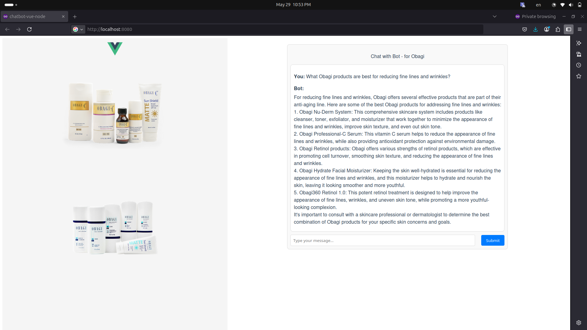

# Obagi Chatbot Project

## Overview
This project is a chatbot application designed to assist users with questions related to Obagi skincare products. The chatbot ensures that queries are relevant to Obagi by filtering user inputs. It uses the ChatGPT API (via OpenAI) to generate responses, which are displayed on a Vue.js front-end interface. The back-end is built with Node.js to handle API requests securely.

## Project Flow
1. **Front Page**: Users can interact with the chatbot via a simple front-end interface built with Vue.js. The interface allows users to ask questions and displays responses.
2. **Obagi Restriction**: The chatbot only responds to questions related to Obagi products. It checks user queries for relevance using keyword matching (e.g., "obagi", "skincare", "vitamin c", etc.).
3. **API Integration**: When a user submits a question, the Node.js server sends the query to the ChatGPT API (via OpenAI) to generate a response.
4. **Response Display**: The response from ChatGPT is sent back to the front-end and rendered in the Vue.js interface with HTML formatting (newlines are converted to `<br>` tags for better readability).
5. **API Key Security**: The ChatGPT API key is stored securely in a `.env` file and accessed via the `dotenv` package in Node.js.

## Tech Stack
- **Back-End**: Node.js with Express to handle API requests.
- **Front-End**: Vue.js to create an interactive user interface.
- **API**: OpenAI's ChatGPT API for generating responses.
- **Dependencies**: `axios` for API calls, `cors` for cross-origin requests, and `dotenv` for environment variables.

## Setup Instructions
To run the project locally, follow these steps:

1. **Clone the Repository**:
   ```bash
   git clone https://github.com/ajayashokgokhale/chatbot-node-vuejs-chatgpt.git
   cd chatbot-node-vuejs-chatgpt
   ```

2. **Install Dependencies**:
    - For the Node.js server:
      ```bash
      npm install
      ```
    - For the Vue.js front-end:
      ```bash
      cd <vue-project-directory>
      npm install
      ```

3. **Set Up Environment Variables**:
    - Create a `.env` file on the project root and add the ChatGPT API key like this:
      ```
      OPENAI_API_KEY=sk-proj-your-api-key
      ```

4. **Start the Node.js Server**:
    - Run the following command to start the server:
      ```bash
      node obagi-server.js
      ```
    - The server will run on `http://localhost:3000` by default (or the port specified in your `.env` file).

5. **Start the Vue.js Front-End**:
    - In a separate terminal, navigate to the Vue.js project directory and run:
      ```bash
      npm run serve
      ```
    - The front-end will be available at `http://localhost:8080/`.

6. **Access the Chatbot**:
    - Open your browser and navigate to `http://localhost:8080/` to interact with the chatbot.


## Screenshots
Below is a screenshot of the Obagi Chatbot interface:



## Sample Questions
Below are sample questions you can use to test the chatbot. These questions are categorized based on different user personas and their skincare concerns related to Obagi products.

### As a Mother of a 10-Year-Old Son
#### For Myself:
- What Obagi products are best for reducing fine lines and wrinkles?
- Can Obagi products help with dark spots or uneven skin tone?
- Are Obagi products safe to use during pregnancy or breastfeeding?
- How long does it take to see results with Obagi Nu-Derm products?
- Do Obagi products have any side effects I should be aware of?

#### For My Son:
- Can my 10-year-old use Obagi sunscreen for sensitive skin?
- Are there any Obagi products suitable for children's dry or irritated skin?
- Is Obagi Hydrate safe for kids with eczema or dryness issues?
- What Obagi product can I use to protect my child's skin during outdoor activities?

#### General Skincare:
- How should I apply Obagi sunscreen for maximum protection?
- What is the difference between Obagi's Vitamin C products and regular moisturizers?
- Can I use Obagi products alongside other skincare brands?

#### For the Family:
- Is there an Obagi product that works for all skin types in the family?
- Does Obagi offer any bundles or deals for family skincare needs?

---

### As a Father of a 21-Year-Old Daughter
#### For My Daughter's Skincare:
- Which Obagi products are best for acne-prone skin?
- Can Obagi help with acne scars or post-acne marks?
- What Obagi product can help with oily skin control?
- Is Obagi safe for daily use on sensitive skin?
- Are there Obagi products designed to prevent early signs of aging?

#### For Sun Protection:
- Which Obagi sunscreen is best for outdoor activities like sports?
- Can Obagi sunscreens be used under makeup?
- What is the SPF level of Obagi's sunscreen products?

#### For General Skin Concerns:
- Does Obagi offer a product to brighten dull skin?
- Are there Obagi products to reduce dark circles under the eyes?
- How effective are Obagi Vitamin C serums for youthful skin?

#### For a Busy Lifestyle:
- Are Obagi products easy to incorporate into a quick skincare routine?
- How often should my daughter apply Obagi moisturizers or treatments?

#### For Occasions:
- Which Obagi product works best for preparing skin for special occasions like weddings or parties?
- Can Obagi products help with last-minute breakouts or skin emergencies?

#### For a Budget-Friendly Approach:
- Are there affordable Obagi starter kits for someone new to the brand?
- Which Obagi product offers the best value for students?

---

### As a 32-Year-Old Woman, Three Months Pregnant
#### Safety During Pregnancy:
- Are Obagi products safe to use during pregnancy?
- Which Obagi products should I avoid while pregnant?
- Can I use Obagi's Vitamin C serum during pregnancy?
- Are there any ingredients in Obagi products that may harm my baby?

#### Skincare for Pregnancy-Related Issues:
- Does Obagi have products that help with pregnancy-related hyperpigmentation (melasma)?
- Can Obagi products help with stretch marks?
- What is the best Obagi product for dry, sensitive skin during pregnancy?
- Are Obagi products effective for hormonal acne during pregnancy?

#### Sun Protection:
- Which Obagi sunscreen is best for pregnant women?
- Does Obagi have a physical (mineral) sunscreen that is safe during pregnancy?

#### General Use During Pregnancy:
- Can I continue my current Obagi skincare routine while pregnant?
- Are Obagi products safe for long-term use during breastfeeding?

#### Special Concerns:
- Is it safe to use Obagi exfoliating products while pregnant?
- How can I maintain a pregnancy-safe skincare routine with Obagi products?

## Notes
- The chatbot is restricted to answering questions related to Obagi products only. If a user asks an unrelated question, the chatbot will return an error message.
- Ensure that the OpenAI API key is kept secure and not exposed in the front-end code.
- The front-end renders responses with HTML formatting, converting double newlines (`\n\n`) to `<br>` tags for better readability.